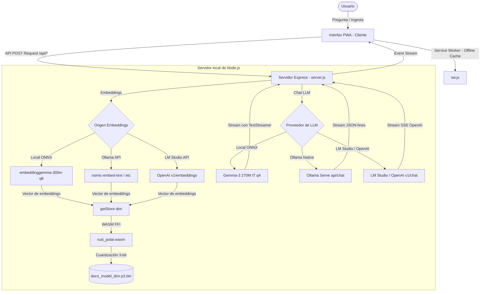

# JS-PotatoRAG 🥔 - Local AI Vector Console & PWA

**JS-PotatoRAG** es una consola RAG (Retrieval-Augmented Generation) de inteligencia artificial local, rápida, eficiente y ejecutable en un solo proceso. Es una **Aplicación Web Progresiva (PWA)** diseñada para funcionar air-gapped **una vez descargados los modelos** (ver nota sobre air-gapped en la sección de uso).

Combina una base de datos vectorial ultraligera escrita en Rust y compilada a **WebAssembly (WASM)**, extracción de embeddings locales en **ONNX Runtime** y un LLM local en proceso (**Gemma 3 270M IT**) o integraciones en caliente con daemons locales como **Ollama** y **LM Studio** (OpenAI compatible).

---

## 🚀 Características Principales

*   **PWA Instalable e Instantánea**: Convierte la interfaz en una aplicación de escritorio o móvil con precarga estática offline mediante un Service Worker.
*   **Búsqueda Vectorial WASM (Rust)**: Base de datos vectorial indexada en 3 bits con polarización angular (`PolarQuantizedStore`), ofreciendo un **7.1x de velocidad** comparado con JavaScript puro (escaneando 10,000 vectores en solo **14.9 ms**).
*   **Ahorro de Memoria de 21.3x**: Compresión vectorial extrema: cada vector de 768-D ocupa 144 bytes (≈137 MB por millón de vectores *solo para los datos cuantizados*; los `ids` y la metadata se guardan aparte en JSON y crecen linealmente). Este número es aritmético sobre `bytes/vector`, no un benchmark de 1M de vectores ejecutado.
*   **Embeddings ONNX Locales**: Extracción integrada mediante `@huggingface/transformers` con el modelo `embeddinggemma-300m` quantizado en 8 bits (`q8`), procesado en **~158 ms** en CPU.
*   **Generador LLM In-Process**: Soporta el nuevo modelo **Google Gemma 3 270M (IT - q4)** de 150 MB, ejecutándose de forma local dentro del proceso de Node.js a más de **27 tokens/segundo** (sin necesidad de Ollama o LM Studio activos).
*   **Soporte Multi-Proveedor**: Panel de ajustes avanzado en la barra lateral para alternar en caliente entre el generador ONNX interno, Ollama y servidores OpenAI compatibles (LM Studio, vLLM, LocalAI).
*   **Aislamiento y Autoescalado Vectorial**: Escala dinámicamente las dimensiones del vector en la base de datos WASM y aísla los archivos por modelo (`docs_<model>_<dim>.p3.bin`) para evitar colisiones.

---

## 📐 Arquitectura del Sistema

El siguiente diagrama muestra el flujo de datos autocontenido de JS-PotatoRAG:



---

## ⚡ Pruebas de Rendimiento (Benchmark Local)

Pruebas ejecutadas localmente sobre una base de datos de **10,000 vectores sintéticos** de **768 dimensiones**:

*   **Ingesta y Cuantización (WASM Rust)**: **160 ms** para procesar e indexar 10k vectores (1.3x más rápido que JS puro).
*   **Búsqueda Vectorial WASM (top-10)**: **14.98 ms** avg/consulta (frente a 105.68 ms en JS puro, **7.1x de velocidad**).
*   **Extracción de Embeddings Local ONNX**: **158.84 ms** por fragmento de texto.
*   **Inferencia LLM Gemma 3 270M local**: **27.41 tokens/segundo** (carga del modelo en memoria en solo **1.24s**). *Nota: el conteo de tokens en `benchmark_gemma3.js` es una estimación (`palabras × 1.3`), no el conteo real del tokenizer.*

> **Calidad de recuperación**: la cuantización polar es con pérdida. Ejecutá `node benchmark_recall.js` para medir recall@k de la compresión 3-bit frente a la búsqueda exacta float32 (usa embeddings de Ollama si están disponibles, o un corpus sintético agrupado si no). Subir de 3 a 5 bits casi no mejora el recall@k>1: la pérdida viene de la rotación/aproximación polar, no de la granularidad de bits.

---

## 🛠️ Instalación y Uso

### 1. Requisitos Previos
*   [Node.js](https://nodejs.org/) (Versión 18 o superior recomendada, desarrollado en Node v24).
*   (Opcional) Ollama o LM Studio ejecutándose localmente si deseas usar modelos externos más grandes.

### 2. Clonar e Instalar Dependencias
```bash
git clone https://github.com/MauricioPerera/JS-PotatoRAG.git
cd JS-PotatoRAG
npm install
```

### 3. Iniciar la Aplicación
```bash
npm start
```
El servidor backend se iniciará en **`http://localhost:3005`** (escucha solo en `127.0.0.1` por defecto; exponé en la red con `HOST=0.0.0.0`). El embedder local ONNX se carga de forma diferida en la primera petición que use `embedSource: local`, así que el arranque es instantáneo aunque uses Ollama/LM Studio.

### 4. Probar en el Navegador
Abre `http://localhost:3005` en tu navegador:
*   Para un funcionamiento **in-process**: Selecciona **LLM Provider: Local ONNX** y **Embedding Source: Local ONNX** en la configuración lateral. El primer mensaje descargará y cacheará automáticamente los modelos desde Hugging Face. **Ojo: qué modelos se bajan depende del modo** (ver la tabla "Qué modelos corre cada modo" más abajo) — con backend Node son los de Gemma (~150 + ~300 MB); en modo navegador puro son MiniLM + Qwen-0.5B (~23 + ~786 MB). La etiqueta "Gemma-3 270M" del menú aplica al modo servidor; en navegador ese mismo botón corre Qwen. **Air-gapped es total solo DESPUÉS de esa primera descarga**, y de forma parcial: la librería Transformers.js viene local (`public/vendor/`), pero el runtime ONNX (`ort-wasm-*.wasm`) y los pesos de los modelos se bajan de CDN en el primer uso.
*   Para usar **LM Studio**: Enciende el servidor de LM Studio en el puerto `1234`, carga un modelo de chat y de embeddings, y ajusta el panel lateral a `LM Studio / OpenAI compatible` y base URL `http://localhost:1234/v1`.
*   Para usar **Ollama**: Enciende Ollama en el puerto `11434` y selecciona `Ollama Native API`.

---

## 🧩 Qué modelos corre cada modo (¡importante!)

El proyecto tiene **dos caminos de ejecución que usan modelos DISTINTOS y hardcodeados**. La marca "Gemma" del README y los benchmarks aplica **solo al modo servidor**.

| | **Modo servidor** (Node, `server.js`) | **Modo navegador** (serverless, `index.html`) |
| :--- | :--- | :--- |
| Embeddings (local ONNX) | `embeddinggemma-300m` · **768-D** | `Xenova/all-MiniLM-L6-v2` · **384-D** |
| LLM in-process (local ONNX) | `gemma-3-270m-it` (q4) | `Qwen2.5-0.5B-Instruct` (q4, **~786 MB**) |
| Cuándo se activa | hay backend Node escuchando | no hay backend → fallback automático |

El modo navegador se activa solo cuando la PWA no encuentra el backend (sirviendo `public/` como sitio estático). Sus modelos están fijados en el código ([`index.html`](public/index.html)), no son configurables desde la UI.

**Consecuencia: los dos modos NO son intercambiables.** Como usan modelos y dimensiones distintos, la colección se llama distinto (`docs_<modelo>_<dim>`) y los vectores no son comparables. Una base creada en el servidor (embeddinggemma, 768-D) **no se puede consultar ni importar desde el navegador** (MiniLM, 384-D), y viceversa. El Export/Import funciona **dentro del mismo modo**, no entre modos.

**Rendimiento medido en navegador** (CPU/WASM, Chrome): embeddings MiniLM ~**11 ms/chunk** (carga 23 MB) — rápido y usable; el LLM Qwen-0.5B es una descarga de **~786 MB** y corre en **CPU/WASM** (el código no activa WebGPU), por lo que la generación in-browser es **muy lenta / poco práctica** en máquinas comunes. Para generación usable en modo navegador, delegá el LLM a Ollama/LM Studio del equipo, o activá `device: 'webgpu'` en el código.

---

## 💾 Persistencia, Export e Import

La base de datos **persiste automáticamente** — no se regeneran los embeddings en cada arranque:

*   **Modo server**: cada colección son dos archivos en `data/vectors/`: `docs_<modelo>_<dim>.p3.bin` (vectores cuantizados) y `docs_<modelo>_<dim>.p3.json` (`ids` + texto de cada chunk + `dim/bits/seed`). Se recargan solos al reiniciar.
*   **Modo browser (serverless)**: la DB vive en IndexedDB (`PotatoRAG_DB`).

Para **mover o respaldar** una colección, usá los botones **⬇️ Export DB / ⬆️ Import DB** de la barra lateral (funcionan en ambos modos), o los endpoints:

*   `POST /api/export` con `{ settings }` → descarga un único `.potatorag.json` autocontenido (params + ids + texto + vectores en base64).
*   `POST /api/import` con `{ data, mode }` (`mode`: `replace` por defecto, o `merge`) → carga la colección.

El import **valida compatibilidad** (`dim/bits/seed`) y falla con un mensaje claro si no coinciden, en vez de devolver resultados corruptos. Un export solo se puede importar con el **mismo modelo de embeddings** que lo generó.

---

## 🧠 Memoria para Agentes (HTTP + MCP)

El mismo store sirve como **memoria local de un agente**: escribir, recordar por búsqueda semántica, filtrar por tags, olvidar — todo offline.

### API HTTP

| Endpoint | Cuerpo | Qué hace |
| :--- | :--- | :--- |
| `POST /api/memory/write` | `{ text, tags?, namespace?, id? }` | Embebe y guarda un recuerdo. Devuelve su `id`. |
| `POST /api/memory/search` | `{ query, k?, namespace?, tags?, filter? }` | Recall semántico top-k, con filtro opcional por tags/metadata. |
| `POST /api/memory/forget` | `{ id? | tags? | filter?, namespace? }` | Borra por id, por tags o por filtro. |
| `POST /api/memory/list` | `{ namespace?, limit?, tags? }` | Lista recuerdos (inspección). |

Los **namespaces** aíslan memorias por agente/sesión (colección `mem_<ns>_<modelo>_<dim>`).

### Servidor MCP

`mcp-memory-server.mjs` expone la memoria como tools MCP (`memory_write`, `memory_search`, `memory_forget`, `memory_list`) para que un agente la use de forma nativa. Es un cliente delgado sobre la API HTTP, así que **primero corré `npm start`**.

Registralo en tu cliente MCP (ej. Claude Code / Claude Desktop `mcpServers`):

```json
{
  "mcpServers": {
    "potatorag-memory": {
      "command": "node",
      "args": ["/ruta/a/JS-PotatoRAG/mcp-memory-server.mjs"],
      "env": {
        "MEMORY_API_URL": "http://127.0.0.1:3005",
        "MEMORY_NAMESPACE": "default",
        "EMBED_SOURCE": "ollama",
        "EMBED_MODEL": "embeddinggemma",
        "EMBED_DIM": "768"
      }
    }
  }
}
```

Variables: `MEMORY_API_URL`, `MEMORY_NAMESPACE`, `EMBED_SOURCE` (`ollama`/`local`/`openai`), `EMBED_MODEL`, `EMBED_DIM`, `EMBED_URL`.

---

## 🌐 RAG estático consumible por un agente (GitHub Pages)

Podés publicar tu base como **archivos estáticos** y que un agente la consulte sin servidor: GitHub Pages (o cualquier host estático) sirve el índice + la librería de búsqueda, y el agente **baja el índice y hace la búsqueda él mismo** con `js-vector-store` (JS puro, sin dependencias, corre en Node). No hay API que correr — Pages no ejecuta código.

```
tu-sitio/ (GitHub Pages)
├── llms.txt                      # describe el sitio + sección ## Skills
├── skills/rag-query/SKILL.md     # instrucciones para el agente
├── js-vector-store.js            # la función de búsqueda (estática)
└── rag/
    ├── manifest.json             # collection, dim, bits, seed, model
    ├── <collection>.p3.json      # ids + texto de cada chunk
    └── <collection>.p3.bin       # vectores cuantizados
```

**Publicar el índice** (desde una colección ya ingestada en `data/vectors/`):

```bash
npm run publish:index -- docs_embeddinggemma_768 embeddinggemma
# copia los .p3 a public/rag/ y escribe public/rag/manifest.json
```

Luego commiteás `public/` a tu rama de Pages.

**Cómo lo consume un agente** (vía el estándar [llms.txt Skills](https://github.com/MauricioPerera/llms-txt-skills)): un agente con la skill `llms-txt-aware` que apunte a tu sitio hace `GET /llms.txt`, descubre la skill `rag-query`, y sigue su receta: baja `manifest.json` + los `.p3` + `js-vector-store.js`, **embebe la query con el modelo de `manifest.model`**, y corre `store.search()` localmente. Devuelve los chunks (`metadata.text`) como contexto.

> **Requisito clave**: el agente debe embeber la query con el **mismo modelo** que generó el índice (lo dice `manifest.model`). Distinto modelo/dimensión ⇒ el store lo rechaza (load guard) o da resultados sin sentido. El test [`test/consume.test.js`](test/consume.test.js) verifica que un índice escrito por el servidor (WASM) se consume correctamente con el `js-vector-store` puro que baja el agente.

---

## ⚙️ Estructura del Proyecto

*   `server.js`: Servidor Express. Endpoints: `/api/ingest`, `/api/query`, `/api/chat` (SSE), `/api/export`, `/api/import`, `/api/memory/{write,search,forget,list}`, `/api/stats`. Carga los modelos ONNX de forma diferida.
*   `js-vector-store.js`: Librería de la base vectorial (JS puro, sin dependencias): `PolarQuantizedStore` y otros stores, `MemoryStorageAdapter`/`FileStorageAdapter`, BM25, búsqueda híbrida. Corre en Node y en el navegador.
*   `wasm-vector-store.cjs` y `wasm-polar-store.cjs`: Wrappers FFI que pasan datos al módulo WebAssembly (`exportCollection`/`importCollection`, `remove`, `search` con filtro, `list`).
*   `rust_polar/` y `rust_polar.wasm`: Motor Rust de búsqueda/cuantización polar 3-bit y su binario WASM. Recompilá con `rust_polar/build.sh` si tocás `lib.rs`.
*   `mcp-memory-server.mjs`: Servidor MCP que expone la memoria (`memory_write/search/forget/list`) a un agente (cliente delgado sobre la API HTTP). `npm run mcp`.
*   `scripts/publish-index.js`: Publica una colección como índice estático en `public/rag/` para consumo por agentes. `npm run publish:index`.
*   `public/`: PWA (HTML, CSS, Service Worker), la copia servida de `js-vector-store.js`, el `llms.txt` + `skills/rag-query/SKILL.md`, y los stores de navegador. `public/vendor/transformers.min.js` vendorizado.
*   `docs/QUANTIZATION.md`: Cómo funciona la cuantización polar, límites medidos, atribución (PolarQuant/TurboQuant) y cuándo optimizarla.
*   `test/`: Suite `node --test` (paridad JS↔WASM, recall, export/import, memoria, consumo por agente, sincronía de copias). `npm test`.
*   `benchmark_wasm.cjs`, `benchmark.js`, `benchmark_onnx.js`, `benchmark_gemma3.js`, `benchmark_recall.js`: Benchmarks de velocidad, RAG end-to-end, embeddings, generación y recall@k.

---

## 📄 Licencia

Este proyecto está bajo la licencia MIT.
